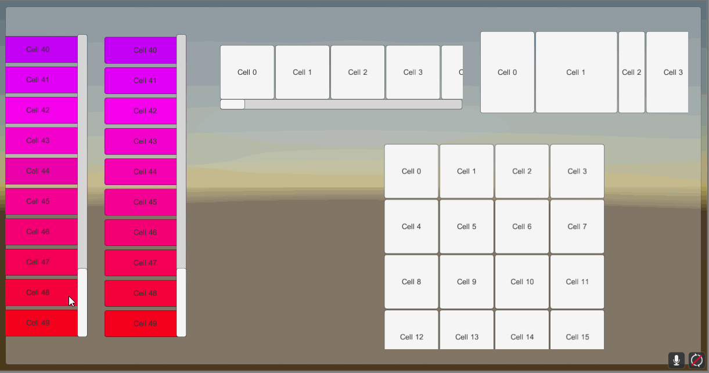
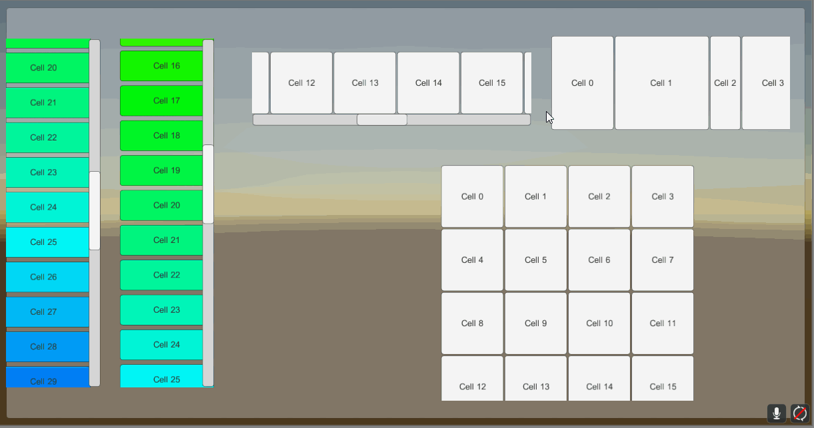
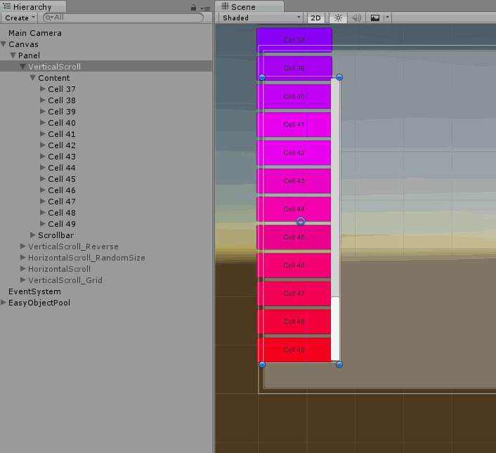
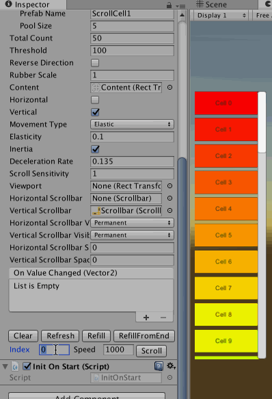
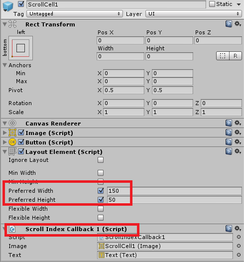
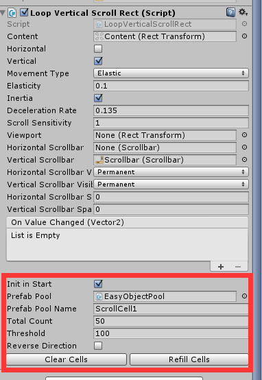

# Unity Loop Scroll Rect

## 

__This project works for Unity 5.2 or newer.__ 

These scripts help make your ScrollRect `Reusable`, because it will only build cells when needed. If you have a large number of cells in a scroll rect, you absolutely need it! It will save a lot of time loading and draw call, along with memory in use, while still working smoothly.

## Demo

Demo for Loop Scroll Rect. Each cell knows its own index, and it is able to modify its content/size/color easily.

Also ScrollBar is supported now! It supports both vertical & horizontal directions, back and forth.

Demo without mask. As you can see, the cells are only instantiated when needed and recycled.

**New**: Scroll to Index

## Introduction

- Avoid using `sizeDelta` directly since it doesn't always mean size
- Support GridLayout
- Avoid blocking when dragging back
- Take advantage of pool rather than instantiate/destroy every time
- Improve some other details for performance
- Supports reverse direction
- **Supports ScrollBar** (this doesn't work in Infinite mode, and may behavior strange for cells with different size)

### Infinite Version

If you need scroll infinitely, you can simply set `totalCount` to a negative number.

### Quick Jump

I've implemented a simple version with `Coroutine`. You can use the following API:

    public void SrollToCell(int index, float speed)

Here is a corner case unsolved yet: You can't jump to the last cells which cannot be pulled to the start.

## Example: Loop Vertical Scroll Rect

These steps may be confusing, so you can just open the demo scene and copy & paste :D

You can also remove EasyObjPool and use your pool instead.

- Prepare cell prefabs
    - The cell needs `Layout Element` attached and preferred width/height
    - You should add a script receiving message `void ScrollCellIndex (int idx) `

- Right click in Hierarchy and click **UI/Loop Horizontal Scroll Rect** or **UI/Loop Vertical Scroll Rect**. It is the same for these two in the Component Menu.
    - Init in Start: call Refill cells automatically when Start
    - Prefab Pool: the EasyObjPool gameObject
    - Prefab Pool Name: the corresponding pool in step 1
    - Total Count: How many cells are available (index: 0 ~ TotalCount-1)
    - Threshold: How many additional pixels of content should be prepared before start or after end?
    - ReverseDirection: If you want scroll from bottom or right, you should toggle this
    - Clear Cells: remove existing cells and keep uninitialized
    - Refill Cells: initialize and fill up cells

If you need scroll from top or left, setting content's pivot to 1 and disable ReverseDirection. Otherwise, you should set 0 to pivot and enable ReverseDirection.

More details can be found in the demo scene.
